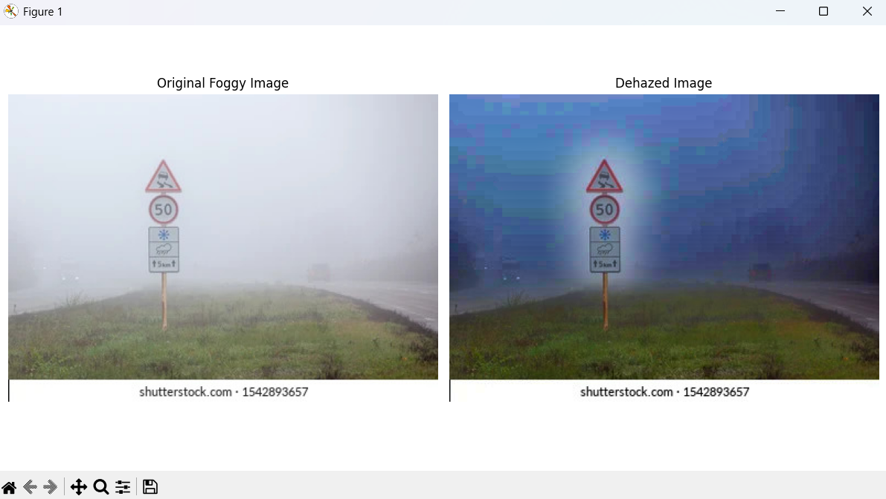
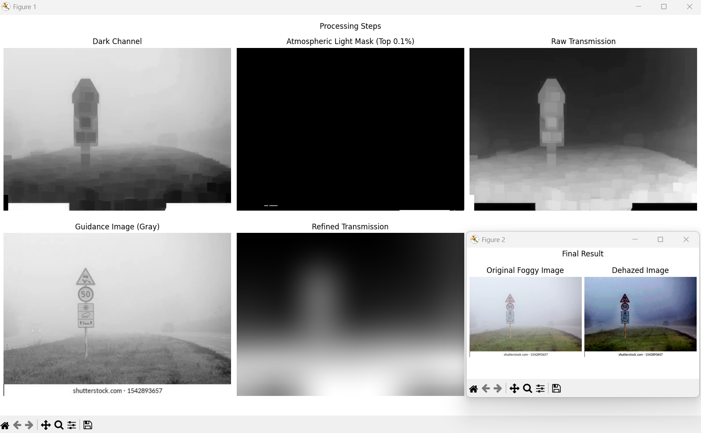

# Image Dehazing Tool

This project implements a Single Image Haze Removal algorithm using the **Dark Channel Prior** method. It provides two difference scripts to interact with the dehazing process: one for a direct result and another for a detailed educational breakdown.

## The Scripts

### 1. `dehaze.py` (Standard Dehazer)
This is the main tool for dehazing images. It takes a foggy input image and produces a clear, dehazed output side-by-side.
- **Best for:** Simply getting a dehazed image.
- **Output:** A clean comparison of "Original Foggy Image" vs "Dehazed Image".



### 2. `logic_dehaze.py` (Logic & Visualization)
This script is designed to help you *understand* the algorithm. It breaks down the dehazing process and visualizes every intermediate stage (Dark Channel, Atmospheric Light, Transmission Map, etc.).
- **Best for:** Understanding how the model treats the input and identifying haze density.
- **Output:** Two windows — one showing the detailed "Processing Steps" and another showing the final result.



## How It Works (The Algorithm)

Both scripts utilize the same underlying logic based on the **Dark Channel Prior**. Here is how the model treats the input image:

### 1. Dark Channel Prior Estimation
The algorithm calculates the **Dark Channel**, based on the observation that in non-sky patches of haze-free images, at least one color channel has very low intensity.
- **In `logic_dehaze.py`**: You see this as a dark, grayscale map where hazy areas (which violate the prior) appear brighter.

### 2. Atmospheric Light Estimation
It estimates the **Atmospheric Light** (ambient light) by picking the top 0.1% brightest pixels in the dark channel. These usually correspond to the most opaque haze.
- **In `logic_dehaze.py`**: A white mask highlights exactly which pixels were chosen as the light source.

### 3. Transmission Map Estimation
The **Transmission Map** represents how much light reaches the camera without scattering.
- **In `logic_dehaze.py`**: Displayed as a "Raw Transmission" map. Darker regions indicate thicker haze.

### 4. Transmission Refinement (Guided Filter)
To avoid halos and blocky artifacts, a **Guided Filter** is applied. It uses the original image edges to refine the transmission map.
- **In `logic_dehaze.py`**: You can see the transition from the rough "Raw" map to the smooth "Refined" map.

### 5. Scene Recovery
Finally, the scene radiance is recovered using the refined transmission map, following the physical model of atmospheric scattering.

## How to Run

### Prerequisites

Install the required dependencies:
```bash
pip install -r requirements.txt
```
*(Or manually: `pip install opencv-python numpy matplotlib`)*

### Running the Tools

1.  **For the Standard Dehazer:**
    ```bash
    python dehaze.py
    ```
    Select your image, and it will display the before/after result.

2.  **For the Logic Visualization:**
    ```bash
    python logic_dehaze.py
    ```
    Select your image, and it will open detailed figure windows showing the internal processing steps.

---
**Sample Images**: You can find sample foggy images in the `Sample Images` directory to test the tools.

## Project Report

For a complete academic analysis, including the methodology, digital signal processing concepts, and detailed results, you can view the full project report:

📄 **[View Project Report](public/Project_Report.pdf)**
